# 📊 Database ERD — PLN DIGI
> Dokumentasi lengkap struktur database, entitas, atribut, relasi, dan kegunaan setiap tabel pada aplikasi PLN DIGI.

---

## Daftar Isi
1. [Gambaran Umum Arsitektur Database](#1-gambaran-umum-arsitektur-database)
2. [Diagram ERD (Entity Relationship Diagram)](#2-diagram-erd)
3. [Penjelasan Detail Setiap Tabel](#3-penjelasan-detail-setiap-tabel)
   - [users](#31-tabel-users)
   - [tariff_categories](#32-tabel-tariff_categories)
   - [tariffs](#33-tabel-tariffs)
   - [payment_methods](#34-tabel-payment_methods)
   - [customers](#35-tabel-customers)
   - [meter_readings](#36-tabel-meter_readings)
   - [bills](#37-tabel-bills)
   - [transactions](#38-tabel-transactions)
4. [Peta Relasi Antar Tabel](#4-peta-relasi-antar-tabel)
5. [Alur Bisnis Berdasarkan ERD](#5-alur-bisnis-berdasarkan-erd)
6. [Keputusan Desain & Normalisasi](#6-keputusan-desain--normalisasi)

---

## 1. Gambaran Umum Arsitektur Database

Database PLN DIGI dirancang menggunakan prinsip **Normalisasi 3NF (Third Normal Form)** untuk menghilangkan redundansi data dan memastikan konsistensi. Terdapat **8 tabel utama** yang dibagi ke dalam 4 kelompok:

```
┌─────────────────────────────────────────────────────────┐
│                  LAPISAN DATABASE                       │
│                                                         │
│  [MASTER DATA]          [DATA PELANGGAN]                │
│  ┌──────────────┐       ┌──────────────┐                │
│  │    users     │       │  customers   │                │
│  └──────────────┘       └──────────────┘                │
│  ┌──────────────┐       ┌──────────────┐                │
│  │   tariffs    │       │meter_readings│                │
│  └──────────────┘       └──────────────┘                │
│  ┌──────────────┐       ┌──────────────┐                │
│  │tariff_categ..│       │    bills     │                │
│  └──────────────┘       └──────────────┘                │
│  ┌──────────────┐                                       │
│  │payment_meth..│       [TRANSAKSI]                     │
│  └──────────────┘       ┌──────────────┐                │
│                         │ transactions │                │
│                         └──────────────┘                │
└─────────────────────────────────────────────────────────┘
```

| Kelompok | Tabel | Keterangan |
|---|---|---|
| **Master Data** | `users`, `tariff_categories`, `tariffs`, `payment_methods` | Data referensi yang jarang berubah |
| **Data Pelanggan** | `customers` | Data utama pelanggan PLN |
| **Data Operasional** | `meter_readings`, `bills` | Data bulanan: pembacaan meteran & tagihan |
| **Transaksi** | `transactions` | Semua transaksi finansial (tagihan, token, pasang baru) |

---

## 2. Diagram ERD

> **Catatan:** Diagram menggunakan sintaks **Mermaid**. Dapat divisualisasikan langsung di GitHub, VS Code (dengan ekstensi Markdown Preview Mermaid), atau di [mermaid.live](https://mermaid.live).

```mermaid
erDiagram
    users {
        bigint id PK
        string name
        string email
        string password
        enum role "admin atau user"
        timestamp email_verified_at
        timestamp created_at
        timestamp updated_at
    }

    tariff_categories {
        bigint id PK
        string kode UK "R, B, I, S"
        string nama "Rumah Tangga, Bisnis, dll"
        text deskripsi
        timestamp created_at
        timestamp updated_at
    }

    tariffs {
        bigint id PK
        bigint tariff_category_id FK
        string kode UK "R1-450, R1-900, B1-6600"
        string nama "Rumah Tangga 450VA"
        int daya_va "450, 900, 1300, 2200, 3500..."
        decimal harga_per_kwh "Rp per kWh"
        decimal biaya_beban "Biaya tetap per bulan"
        decimal biaya_pasang "Biaya pasang baru"
        decimal biaya_admin "Biaya administrasi pasang"
        boolean is_subsidi "Apakah tarif bersubsidi?"
        timestamp created_at
        timestamp updated_at
    }

    payment_methods {
        bigint id PK
        string kode UK "qris, gopay, bca, dll"
        string nama "Nama tampilan"
        string icon "Nama file / kelas ikon"
        boolean is_active "Aktif/Nonaktif"
        timestamp created_at
        timestamp updated_at
    }

    customers {
        bigint id PK
        bigint user_id FK "nullable: opsional link ke akun"
        bigint tariff_id FK
        string id_pelanggan UK "Nomor ID pelanggan PLN"
        string nama "Nama lengkap pelanggan"
        text alamat
        string nomor_telepon
        string email
        boolean status_aktif "Apakah sambungan aktif?"
        timestamp created_at
        timestamp updated_at
    }

    meter_readings {
        bigint id PK
        bigint customer_id FK
        tinyint bulan "1-12"
        smallint tahun "Contoh: 2025, 2026"
        int meteran_awal "Stand awal bulan"
        int meteran_akhir "Stand akhir bulan"
        int total_kwh "COMPUTED: akhir - awal"
        enum status "pending, verified, billed"
        timestamp created_at
        timestamp updated_at
    }

    bills {
        bigint id PK
        bigint customer_id FK
        bigint meter_reading_id FK
        tinyint bulan
        smallint tahun
        decimal total_kwh "kWh yang ditagihkan"
        decimal total_biaya "Tagihan pokok"
        decimal denda "Denda keterlambatan"
        enum status "unpaid, paid, overdue"
        date tanggal_jatuh_tempo
        date tanggal_bayar "null jika belum lunas"
        timestamp created_at
        timestamp updated_at
    }

    transactions {
        bigint id PK
        bigint user_id FK
        bigint customer_id FK "nullable"
        bigint bill_id FK "nullable: ada jika bayar tagihan"
        bigint payment_method_id FK
        enum type "tagihan, token, pasang_baru"
        decimal amount "Total yang dibayarkan"
        string nominal "Untuk token: 20000, 50000"
        enum status "pending, success, failed"
        string no_meter "Nomor ID pelanggan/meteran"
        string ref_number UK "Nomor referensi unik sistem"
        string token_listrik "Token 20 digit (khusus token)"
        text keterangan "Catatan tambahan"
        timestamp created_at
        timestamp updated_at
    }

    %% ==============================================
    %%  RELASI
    %% ==============================================

    %% users → customers (One-to-Many)
    users ||--o{ customers : "1 user dapat memiliki banyak pelanggan"

    %% users → transactions (One-to-Many)
    users ||--o{ transactions : "1 user dapat melakukan banyak transaksi"

    %% tariff_categories → tariffs (One-to-Many)
    tariff_categories ||--o{ tariffs : "1 kategori memiliki banyak jenis tarif"

    %% tariffs → customers (One-to-Many)
    tariffs ||--o{ customers : "1 tarif digunakan banyak pelanggan"

    %% customers → meter_readings (One-to-Many)
    customers ||--o{ meter_readings : "1 pelanggan punya banyak baca meteran"

    %% customers → bills (One-to-Many)
    customers ||--o{ bills : "1 pelanggan punya banyak tagihan"

    %% customers → transactions (One-to-Many, nullable)
    customers |o--o{ transactions : "1 pelanggan terkait banyak transaksi"

    %% meter_readings → bills (One-to-One)
    meter_readings ||--o| bills : "1 data meteran menghasilkan 1 tagihan"

    %% bills → transactions (One-to-Many)
    bills ||--o{ transactions : "1 tagihan dibayar melalui transaksi"

    %% payment_methods → transactions (One-to-Many)
    payment_methods ||--o{ transactions : "1 metode bayar dipakai banyak transaksi"
```



---

## 3. Penjelasan Detail Setiap Tabel

### 3.1 Tabel `users`

**Fungsi:** Menyimpan data autentikasi dan otorisasi seluruh pengguna aplikasi.

| Kolom | Tipe | Keterangan |
|---|---|---|
| `id` | `bigint` PK | Auto-increment primary key |
| `name` | `string` | Nama lengkap pengguna |
| `email` | `string` UNIQUE | Email untuk login, harus unik |
| `password` | `string` | Password ter-hash (bcrypt) |
| `role` | `enum` | `admin` = akses penuh, `user` = pelanggan biasa |
| `email_verified_at` | `timestamp` | Waktu verifikasi email (opsional) |
| `created_at / updated_at` | `timestamp` | Audit trail Laravel |

**Relasi:**
- `users` → `customers` (**One-to-Many**): Satu akun user bisa terhubung ke banyak data pelanggan (misal: satu user yang mendaftarkan beberapa meteran).
- `users` → `transactions` (**One-to-Many**): Semua transaksi yang dilakukan oleh seorang user dicatat dengan `user_id` miliknya.

**Data Default (Seeder):**
| Email | Role |
|---|---|
| `admin@plndigi.com` | admin |
| `hafizh@mail.com` | user |

---

### 3.2 Tabel `tariff_categories`

**Fungsi:** Tabel **master referensi** untuk pengelompokan jenis tarif PLN berdasarkan sektor pengguna. Tabel ini **tidak memiliki foreign key masuk** — murni sebagai tabel induk.

| Kolom | Tipe | Keterangan |
|---|---|---|
| `id` | `bigint` PK | Auto-increment primary key |
| `kode` | `string` UNIQUE | Kode singkat kategori |
| `nama` | `string` | Nama kategori yang ditampilkan |
| `deskripsi` | `text` nullable | Penjelasan singkat kategori |

**Kode Kategori yang Ada:**

| Kode | Nama | Keterangan |
|---|---|---|
| `R` | Rumah Tangga | Keperluan listrik perumahan |
| `B` | Bisnis | Keperluan listrik usaha & komersial |
| `I` | Industri | Keperluan listrik pabrik & industri besar |
| `S` | Sosial | Keperluan listrik fasilitas publik (sekolah, rumah sakit, dll) |

**Relasi:**
- `tariff_categories` → `tariffs` (**One-to-Many**): Satu kategori (misal: "Rumah Tangga") memiliki banyak jenis tarif (R1-450, R1-900, R1-1300, dst).

**Tidak berelasi langsung ke:** `customers`, `transactions`, `bills`, `users`, `meter_readings`.

---

### 3.3 Tabel `tariffs`

**Fungsi:** Tabel **master** yang menyimpan rincian tarif listrik PLN per golongan. Menggantikan tabel `tariff_types` lama dengan struktur yang lebih lengkap dan terstruktur.

| Kolom | Tipe | Keterangan |
|---|---|---|
| `id` | `bigint` PK | Auto-increment primary key |
| `tariff_category_id` | `bigint` FK | Relasi ke `tariff_categories.id` |
| `kode` | `string` UNIQUE | Kode resmi PLN (misal: `R1-1300`) |
| `nama` | `string` | Nama lengkap tarif |
| `daya_va` | `integer` | Kapasitas daya dalam Volt-Ampere (VA) |
| `harga_per_kwh` | `decimal(10,2)` | Tarif pemakaian per kWh (Rupiah) |
| `biaya_beban` | `decimal(12,2)` | Biaya abonemen tetap per bulan |
| `biaya_pasang` | `decimal(12,2)` | Biaya pasang baru (digunakan di fitur Simulasi) |
| `biaya_admin` | `decimal(12,2)` | Biaya administrasi pasang baru |
| `is_subsidi` | `boolean` | Penanda apakah tarif ini mendapat subsidi pemerintah |

**Data Tarif yang Tersedia:**

| Kode | Daya | Harga/kWh | Subsidi |
|---|---|---|---|
| R1-450 | 450 VA | Rp 415 | ✅ Ya |
| R1-900 | 900 VA | Rp 605 | ✅ Ya |
| R1-1300 | 1.300 VA | Rp 1.444,7 | ❌ Tidak |
| R1-2200 | 2.200 VA | Rp 1.444,7 | ❌ Tidak |
| R2-3500 | 3.500 VA | Rp 1.699,53 | ❌ Tidak |
| R3-6600 | 6.600 VA | Rp 1.699,53 | ❌ Tidak |
| B1-6600 | 6.600 VA | Rp 1.444,7 | ❌ Tidak |
| B2-10K | 10.600 VA | Rp 1.699,53 | ❌ Tidak |
| S2-900 | 900 VA | Rp 605 | ✅ Ya |

**Relasi:**
- `tariffs` → `tariff_categories` (**Many-to-One / BelongsTo**): Setiap tarif tergabung dalam satu kategori.
- `tariffs` → `customers` (**One-to-Many**): Satu jenis tarif bisa dipakai oleh banyak pelanggan.

**Digunakan di fitur:**
- ✅ **Simulasi Pasang Baru** — Tampilkan daftar tarif + hitung estimasi biaya pasang.
- ✅ **Admin: Manajemen Pelanggan** — Pilih tarif saat tambah/edit data pelanggan.
- ✅ **Perhitungan Tagihan** — Kolom `harga_per_kwh` dan `biaya_beban` digunakan untuk kalkulasi `bills.total_biaya`.

---

### 3.4 Tabel `payment_methods`

**Fungsi:** Tabel **master referensi** metode pembayaran yang tersedia di aplikasi. Dirancang sebagai tabel terpisah (bukan enum) agar metode baru bisa ditambah/dinonaktifkan tanpa mengubah skema database.

| Kolom | Tipe | Keterangan |
|---|---|---|
| `id` | `bigint` PK | Auto-increment primary key |
| `kode` | `string` UNIQUE | Kode teknis metode bayar |
| `nama` | `string` | Nama tampilan di UI |
| `icon` | `string` nullable | Nama file ikon atau nama kelas CSS ikon |
| `is_active` | `boolean` | Jika `false`, metode tidak akan ditampilkan ke pengguna |

**Daftar Metode Pembayaran:**

| Kode | Nama | Status |
|---|---|---|
| `qris` | QRIS | ✅ Aktif |
| `gopay` | GoPay | ✅ Aktif |
| `ovo` | OVO | ✅ Aktif |
| `dana` | DANA | ✅ Aktif |
| `bca` | Transfer BCA | ✅ Aktif |
| `mandiri` | Transfer Mandiri | ✅ Aktif |
| `bni` | Transfer BNI | ✅ Aktif |
| `cash` | Tunai | ❌ Nonaktif |

**Relasi:**
- `payment_methods` → `transactions` (**One-to-Many**): Satu metode bayar bisa digunakan oleh banyak transaksi.

**Digunakan di fitur:**
- ✅ **Bayar Tagihan** — Dropdown/pilihan metode bayar saat checkout.
- ✅ **Beli Token** — Sama seperti di atas.
- ✅ **Admin Dashboard** — Menampilkan metode bayar pada riwayat transaksi.

---

### 3.5 Tabel `customers`

**Fungsi:** Tabel **inti** yang menyimpan data pelanggan PLN. Merupakan pusat dari semua data operasional (meteran, tagihan, transaksi).

| Kolom | Tipe | Keterangan |
|---|---|---|
| `id` | `bigint` PK | Auto-increment primary key |
| `user_id` | `bigint` FK **nullable** | Terhubung ke akun `users` (opsional). Jika `null`, pelanggan belum terdaftar akun di sistem. |
| `tariff_id` | `bigint` FK | Jenis tarif yang berlaku untuk pelanggan ini |
| `id_pelanggan` | `string` UNIQUE | Nomor identitas pelanggan PLN (12 digit) |
| `nama` | `string` | Nama lengkap pelanggan |
| `alamat` | `text` | Alamat instalasi meteran |
| `nomor_telepon` | `string` nullable | Nomor telepon untuk notifikasi |
| `email` | `string` nullable | Email pelanggan |
| `status_aktif` | `boolean` | `true` = sambungan aktif, `false` = dicabut/diblokir |

**Kenapa `user_id` bisa NULL?**
> Tidak semua pelanggan PLN memiliki akun di aplikasi. Pelanggan yang belum daftar tetap bisa **dicek tagihannya** menggunakan nomor ID Pelanggan melalui fitur **Cek Tagihan** tanpa login. Ketika pelanggan mendaftar dan menghubungkan ID Pelanggan mereka, `user_id` akan diisi.

**Relasi:**
- `customers` → `users` (**Many-to-One**): Banyak pelanggan bisa terhubung ke satu user.
- `customers` → `tariffs` (**Many-to-One**): Setiap pelanggan menggunakan satu jenis tarif.
- `customers` → `meter_readings` (**One-to-Many**): Satu pelanggan memiliki banyak data baca meteran (satu per bulan).
- `customers` → `bills` (**One-to-Many**): Satu pelanggan memiliki banyak tagihan (satu per bulan).
- `customers` → `transactions` (**One-to-Many**, nullable): Satu pelanggan terkait banyak transaksi.

**Digunakan di fitur:**
- ✅ **Cek Tagihan** — Dicari berdasarkan `id_pelanggan`.
- ✅ **Admin: Manajemen Pelanggan** — CRUD data pelanggan.
- ✅ **Dashboard User** — Menampilkan daftar pelanggan milik user yang login.

---

### 3.6 Tabel `meter_readings`

**Fungsi:** Mencatat **hasil baca meteran** setiap pelanggan untuk setiap bulan. Menjadi sumber data primer untuk pembuatan tagihan (`bills`).

| Kolom | Tipe | Keterangan |
|---|---|---|
| `id` | `bigint` PK | Auto-increment primary key |
| `customer_id` | `bigint` FK | Relasi ke `customers.id` (CASCADE on delete) |
| `bulan` | `tinyint` | Bulan pencatatan (1–12) |
| `tahun` | `smallint` | Tahun pencatatan (misal: 2026) |
| `meteran_awal` | `int` | Stand meter awal bulan (kWh) |
| `meteran_akhir` | `int` | Stand meter akhir bulan (kWh) |
| `total_kwh` | `int` **COMPUTED** | Dihitung otomatis: `meteran_akhir - meteran_awal` |
| `status` | `enum` | Status validasi pencatatan |

**Alur Status `meter_readings`:**
```
pending → verified → billed
  ↑           ↑          ↑
Baru        Sudah      Tagihan
dicatat    dicek     sudah dibuat
petugas    admin
```

| Status | Artinya |
|---|---|
| `pending` | Baru dicatat, belum diverifikasi admin |
| `verified` | Sudah diverifikasi, siap dibuat tagihan |
| `billed` | Tagihan sudah dibuat dari data ini (linked ke `bills`) |

**Constraint Unik:** `(customer_id, bulan, tahun)` — Menjamin **satu pelanggan hanya memiliki satu data baca meteran per bulan**.

**Relasi:**
- `meter_readings` → `customers` (**Many-to-One**): Banyak data meteran milik satu pelanggan.
- `meter_readings` → `bills` (**One-to-One**): Satu baca meteran menghasilkan tepat satu tagihan.

**Cascade Delete:** Jika data pelanggan (`customers`) dihapus, semua data meterannya otomatis ikut terhapus.

---

### 3.7 Tabel `bills`

**Fungsi:** Menyimpan **tagihan listrik pascabayar** yang dibuat berdasarkan data `meter_readings`. Ini adalah "invoice" yang diterima pelanggan setiap bulan.

| Kolom | Tipe | Keterangan |
|---|---|---|
| `id` | `bigint` PK | Auto-increment primary key |
| `customer_id` | `bigint` FK | Relasi ke `customers.id` |
| `meter_reading_id` | `bigint` FK | Relasi ke `meter_readings.id` yang menjadi dasar tagihan |
| `bulan` | `tinyint` | Bulan tagihan |
| `tahun` | `smallint` | Tahun tagihan |
| `total_kwh` | `decimal` | Total pemakaian kWh yang ditagihkan |
| `total_biaya` | `decimal(15,2)` | Total tagihan pokok (dalam Rupiah) |
| `denda` | `decimal(12,2)` | Denda keterlambatan pembayaran (default: 0) |
| `status` | `enum` | Status pembayaran tagihan |
| `tanggal_jatuh_tempo` | `date` | Batas waktu pembayaran |
| `tanggal_bayar` | `date` nullable | Diisi saat tagihan lunas |

**Alur Status `bills`:**
```
unpaid ──→ paid
  │
  └──→ overdue (jika lewat jatuh tempo & belum bayar)
```

| Status | Artinya |
|---|---|
| `unpaid` | Belum dibayar, masih dalam jangka waktu |
| `paid` | Sudah dibayar lunas |
| `overdue` | Melewati jatuh tempo, belum dibayar (denda aktif) |

**Formula Perhitungan Tagihan:**
```
total_biaya = (total_kwh × harga_per_kwh) + biaya_beban
total_bayar = total_biaya + denda
```

**Relasi:**
- `bills` → `customers` (**Many-to-One**): Banyak tagihan milik satu pelanggan.
- `bills` → `meter_readings` (**Many-to-One / One-to-One**): Satu tagihan bersumber dari satu data meteran.
- `bills` → `transactions` (**One-to-Many**): Satu tagihan dapat dibayar melalui satu transaksi (atau re-attempt jika gagal).

**Cascade Delete:** Jika data pelanggan atau data meteran dihapus, tagihan terkait otomatis ikut terhapus.

---

### 3.8 Tabel `transactions`

**Fungsi:** Tabel **pusat pencatatan semua transaksi finansial** di sistem PLN DIGI. Satu tabel menangani 3 jenis produk: **Tagihan Listrik**, **Token Listrik (Prabayar)**, dan **Pasang Baru**.

| Kolom | Tipe | Keterangan |
|---|---|---|
| `id` | `bigint` PK | Auto-increment primary key |
| `user_id` | `bigint` FK | User yang melakukan transaksi (wajib login) |
| `customer_id` | `bigint` FK **nullable** | Pelanggan terkait (bisa `null` jika no_meter tidak terdaftar) |
| `bill_id` | `bigint` FK **nullable** | Diisi jika type = `tagihan`, merujuk ke tagihan yang dibayar |
| `payment_method_id` | `bigint` FK | Metode pembayaran yang dipilih |
| `type` | `enum` | Jenis transaksi |
| `amount` | `decimal(15,2)` | Jumlah yang dibayarkan (Rupiah) |
| `nominal` | `string` nullable | Nominal token yang dibeli (khusus tipe `token`) |
| `status` | `enum` | Status transaksi |
| `no_meter` | `string` nullable | Nomor ID meteran target transaksi |
| `ref_number` | `string` UNIQUE | Nomor referensi unik tiap transaksi (format: `TRX-YYYYMMDD-XXXXX`) |
| `token_listrik` | `string` nullable | Token 20 digit yang dihasilkan (khusus tipe `token`) |
| `keterangan` | `text` nullable | Catatan tambahan transaksi |

**Jenis Transaksi (`type`):**

| Type | Keterangan | `bill_id` | `token_listrik` |
|---|---|---|---|
| `tagihan` | Pembayaran tagihan listrik pascabayar | ✅ Diisi | ❌ `null` |
| `token` | Pembelian token listrik prabayar | ❌ `null` | ✅ Diisi (20 digit) |
| `pasang_baru` | Pengajuan/pembayaran pasang meteran baru | ❌ `null` | ❌ `null` |

**Alur Status Transaksi:**
```
pending ──→ success
   │
   └──→ failed
```

| Status | Artinya |
|---|---|
| `pending` | Transaksi dibuat, menunggu konfirmasi pembayaran |
| `success` | Pembayaran dikonfirmasi berhasil |
| `failed` | Pembayaran gagal (timeout, saldo kurang, dll) |

> **Efek samping saat `success`:**
> - Jika `type = tagihan`: Status `bills` terkait diubah menjadi `paid`, kolom `tanggal_bayar` diisi.
> - Jika `type = token`: `token_listrik` (20 digit) ditampilkan ke pengguna.

**Relasi:**
- `transactions` → `users` (**Many-to-One**): Banyak transaksi dilakukan oleh satu user.
- `transactions` → `customers` (**Many-to-One**, nullable): Banyak transaksi terkait ke satu pelanggan.
- `transactions` → `bills` (**Many-to-One**, nullable): Banyak transaksi (attempt) terkait ke satu tagihan.
- `transactions` → `payment_methods` (**Many-to-One**): Setiap transaksi menggunakan satu metode bayar.

---

## 4. Peta Relasi Antar Tabel

Berikut ringkasan semua relasi beserta jenis dan penjelasannya:

| Dari | Ke | Jenis Relasi | Keterangan |
|---|---|---|---|
| `users` | `customers` | One-to-Many | Satu user bisa memiliki banyak pelanggan |
| `users` | `transactions` | One-to-Many | Satu user bisa melakukan banyak transaksi |
| `tariff_categories` | `tariffs` | One-to-Many | Satu kategori memiliki banyak tarif |
| `tariffs` | `customers` | One-to-Many | Satu tarif digunakan banyak pelanggan |
| `customers` | `meter_readings` | One-to-Many | Satu pelanggan punya banyak data meteran |
| `customers` | `bills` | One-to-Many | Satu pelanggan punya banyak tagihan |
| `customers` | `transactions` | One-to-Many (nullable) | Transaksi bisa terhubung ke pelanggan |
| `meter_readings` | `bills` | One-to-One | Satu baca meteran → satu tagihan |
| `bills` | `transactions` | One-to-Many | Satu tagihan dibayar melalui transaksi |
| `payment_methods` | `transactions` | One-to-Many | Satu metode dipakai banyak transaksi |

### Tabel Tanpa FK Masuk (Tabel Induk Murni):

| Tabel | Alasan |
|---|---|
| `users` | Tabel dasar autentikasi Laravel. Direferensikan oleh tabel lain. |
| `tariff_categories` | Tabel kategori paling atas dalam hierarki tarif. |

---

## 5. Alur Bisnis Berdasarkan ERD

### 5.1 Alur Tagihan Listrik Pascabayar

```
Petugas PLN
    │
    ▼
[meter_readings] ← Catat stand meter awal & akhir per bulan
    │ (status: pending → verified)
    │
    ▼
[bills] ← Buat tagihan dari data meteran yang diverifikasi
    │ (status: unpaid)
    │
    ▼                  Pelanggan membayar
[transactions] ←────────────────────────── (tagihan + payment_method)
    │ (status: pending → success)
    │
    ▼
[bills] ← Update status = paid, isi tanggal_bayar
```

### 5.2 Alur Pembelian Token Listrik

```
User memilih "Beli Token"
    │
    ▼
Input: no_meter + nominal token + payment_method
    │
    ▼
[transactions] ← Buat transaksi type = 'token'
    │ (status: pending)
    │
    ▼
Simulasi konfirmasi pembayaran
    │
    ▼
[transactions] ← Update status = 'success'
                 Generate token_listrik (20 digit)
    │
    ▼
Token ditampilkan ke user
```

### 5.3 Alur Simulasi Pasang Baru

```
User membuka halaman Simulasi
    │
    ▼
[tariff_categories] + [tariffs] ← Tampilkan pilihan daya & golongan
    │
    ▼
Pilih tarif → Hitung estimasi biaya:
    biaya_pasang + biaya_admin + PPN 11%
    │
    ▼
Tampilkan hasil estimasi ke user
(Tidak ada transaksi yang dibuat di tahap simulasi)
```

---

## 6. Keputusan Desain & Normalisasi

### 6.1 Kenapa `tariff_categories` dipisah dari `tariffs`?

Tanpa `tariff_categories`, tabel `tariffs` harus menyimpan nama kategori berulang kali di setiap baris, yang melanggar aturan **1NF/2NF**. Dengan tabel terpisah, penambahan golongan tarif baru (misal: "Kendaraan Listrik") cukup menambah satu baris di `tariff_categories` tanpa mengubah skema.

### 6.2 Kenapa `payment_methods` bukan Enum di `transactions`?

Enum di database bersifat statis — untuk menambah metode bayar baru (misal: "ShopeePay"), harus mengubah skema tabel. Dengan tabel terpisah, admin cukup menambah baris baru dan mengelola status aktif/nonaktif tanpa sentuh kode.

### 6.3 Kenapa `meter_readings` dipisah dari `bills`?

Pemisahan ini mengikuti prinsip **Single Responsibility**:
- `meter_readings` bertanggung jawab atas **akurasi data fisik** (angka di meteran).
- `bills` bertanggung jawab atas **akurasi finansial** (tagihan ke pelanggan).

Ini juga memungkinkan proses validasi (`pending → verified`) sebelum tagihan dikirim, sehingga mencegah tagihan berdasarkan data meteran yang salah.

### 6.4 Kenapa `customer_id` di `transactions` bisa NULL?

Seseorang bisa membeli token untuk nomor meteran yang bukan miliknya (misal: titip bayar untuk orang tua). Jika `no_meter` tidak ditemukan di database `customers`, transaksi tetap bisa diproses tanpa relasi ke tabel customers.

### 6.5 Tentang `total_kwh` sebagai Stored Computed Column

Kolom `total_kwh` di `meter_readings` menggunakan **MySQL Generated Column** (`storedAs`):
```sql
total_kwh INT AS (meteran_akhir - meteran_awal) STORED
```
Nilai ini dihitung otomatis oleh database saat insert/update — tidak perlu menghitung secara manual di PHP, mengurangi risiko bug kalkulasi.

---

> 📝 **Dokumen ini dibuat secara otomatis bersamaan dengan implementasi ERD.**  
> Terakhir diperbarui: September 2026 | Versi: 2.0
