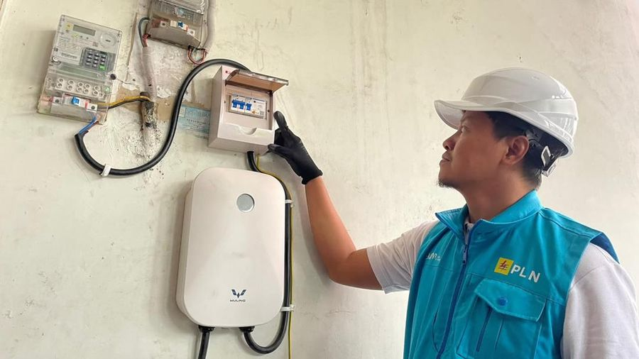

# ⚡ OMNIDIGI — Platform Digital Layanan Kelistrikan Terpadu

<p align="center">
  
</p>

<p align="center">
  <strong>Solusi Cerdas, Cepat, dan Transparan untuk Seluruh Kebutuhan Energi Listrik Anda.</strong>
</p>

<p align="center">
  <a href="https://laravel.com"></a>
  <a href="https://php.net"></a>
  <a href="https://tailwindcss.com"></a>
  <a href="https://vitejs.dev"></a>
  <a href="https://www.sqlite.org"></a>
</p>

---

## 📖 Tentang OMNIDIGI

**OMNIDIGI** adalah aplikasi web modern berbasis *self-service* yang dirancang sebagai platform terpadu pengelolaan layanan kelistrikan digital (mirip ekosistem *PLN Mobile* versi Web). 

Aplikasi ini memberikan kemudahan bagi masyarakat dalam melakukan transaksi pembayaran tagihan pascabayar, pembelian token prabayar, pencatatan meter mandiri (*self-metering*), pemantauan konsumsi daya, pelaporan gangguan kelistrikan (*outage reporting*), hingga simulasi biaya pemasangan baru/perubahan daya secara real-time dan transparan.

---

## 🚀 Fitur Unggulan

### 1. 💳 Pembayaran Tagihan & Token Listrik
- **Cek & Bayar Tagihan Pascabayar**: Pencarian instan tagihan berdasarkan ID Pelanggan dengan rincian pemakaian kWh, tarif, biaya admin, dan status denda/tunggakan.
- **Beli Token Prabayar**: Pembelian token listrik instan dengan pilihan nominal fleksibel (Rp 20.000 s/d Rp 1.000.000) dan generate otomatis kode token 20 digit unik.
- **Metode Pembayaran Lengkap**: Integrasi simulasi QRIS, E-Wallet (GoPay, OVO, DANA), dan Virtual Account Bank (BCA, Mandiri, BNI).

### 2. 📸 Catat Meter Mandiri (*Self-Metering*) & Monitoring
- **Input Angka Meter Mandiri**: Pelanggan dapat menginput foto dan angka *stand meter* bulanan secara mandiri untuk transparansi tagihan.
- **Monitoring Konsumsi Energi**: Visualisasi riwayat pemakaian daya bulanan, perbandingan tren kWh, dan estimasi biaya berjalan.

### 3. 🚨 Pelaporan Gangguan (*Outage Report*)
- **Tiket Pengaduan Real-Time**: Laporkan gangguan padam total, tegangan tidak stabil (*voltage drop*), atau kerusakan meteran dengan deteksi lokasi.
- **Tracking Status Penanganan**: Pantau proses penanganan teknisi langsung dari dashboard (Status: *Dilaporkan* $\rightarrow$ *Diproses* $\rightarrow$ *Selesai*).

### 4. 🧮 Simulasi Tarif & Pasang Baru
- **Kalkulator Biaya Transparan**: Hitung estimasi biaya sambungan baru atau tambah daya berdasarkan kategori tarif (Rumah Tangga, Bisnis, Industri, Sosial) dan daya VA yang dipilih lengkap dengan rincian biaya beban dan administrasi.

### 5. 🎁 PLN Reward & Loyalitas
- **Poin Transaksi**: Kumpulkan poin dari setiap transaksi pembayaran tagihan, beli token, dan pengiriman catat meter tepat waktu.
- **Katalog Voucher & Merchandise**: Tukarkan poin dengan token diskon listrik, kupon belanja, dan merchandise eksklusif.

### 6. 📰 Berita, Tips Hemat Energi & Informasi Pemadaman
- Portal edukasi tips efisiensi energi listrik rumah tangga/industri, informasi promo cashback, serta jadwal pemeliharaan jaringan terencana.

### 7. 🛡️ Panel Admin & CRM Backoffice
- **Dashboard Manajemen CRM**: Kelola data pelanggan, pantau status tagihan lunas/tunggakan, verifikasi bacaan meteran, dan monitor seluruh arus transaksi secara komprehensif.

---

## 🏗️ Arsitektur & Teknologi

- **Backend Framework**: [Laravel 13](https://laravel.com) (PHP 8.4)
- **Frontend & UI**: Blade Templating, [Tailwind CSS](https://tailwindcss.com), [Vite](https://vitejs.dev), Heroicons
- **Database**: MySQL / SQLite (Normalisasi 3NF)
- **Authentication**: Laravel Breeze (Role-Based Access Control: `admin` & `user`)
- **Desain & Warna**: PLN Corporate Identity (PLN Deep Blue `#00529C` & PLN Bright Yellow `#FDB813`)

---

## 📁 Struktur Direktori Proyek

```text
OMNIDIGI/
├── app/
│   ├── Http/
│   │   ├── Controllers/
│   │   │   ├── Admin/          # Controller Backoffice CRM & Manajemen Pelanggan
│   │   │   ├── DashboardController.php  # Dashboard Pengguna, Self-metering, Monitoring
│   │   │   ├── HomeController.php       # Halaman Utama / Landing Page
│   │   │   ├── NewsController.php       # Informasi, Berita & Tips Edukasi
│   │   │   ├── OutageController.php     # Manajemen Pelaporan Gangguan Listrik
│   │   │   ├── ProdukController.php     # Cek/Bayar Tagihan & Pembelian Token
│   │   │   ├── RewardController.php     # Program Loyalitas & Poin PLN Reward
│   │   │   └── SimulasiController.php   # Kalkulator Simulasi Pasang Baru
│   │   └── Middleware/         # AdminMiddleware (Role Guard)
│   └── Models/                 # Eloquent Models (Customer, Bill, Transaction, Tariff, dll)
├── database/
│   ├── migrations/             # Struktur Skema Database
│   └── seeders/                # Data Awal Demo (Users, Pelanggan, Tagihan, Berita)
├── resources/
│   ├── css/                    # Custom Tailwind & Styling Token
│   └── views/                  # Blade Views (Admin, Dashboard, Produk, Auth, Components)
├── routes/
│   ├── web.php                 # Rute Aplikasi Web
│   └── auth.php                # Rute Autentikasi Breeze
├── DATABASE_ERD.md             # Dokumentasi Lengkap Skema Database & ERD
├── INSTALLATION.md             # Panduan Lengkap Instalasi & Setup Proyek
└── README.md                   # Dokumentasi Utama
```

---

## 🔑 Akun Demo Pengujian

Aplikasi telah dilengkapi data *seeder* lengkap untuk pengujian langsung:

| Role | Email | Password | Keterangan |
|---|---|---|---|
| **Admin** | `admin@plndigi.com` | `password` | Akses penuh dashboard backoffice `/admin` |
| **Pelanggan** | `hafizh@mail.com` | `password` | Akun pelanggan dengan histori tagihan & transaksi |

#### Contoh ID Pelanggan untuk Pengujian:
- `531200012345` — Rumah Tangga (R1/1300 VA)
- `531200026789` — Rumah Tangga (R1/2200 VA)
- `531200043344` — Bisnis (B1/6600 VA)

---

## 🚀 Panduan Instalasi & Menjalankan Aplikasi

Untuk panduan instalasi langkah demi langkah dari awal hingga aplikasi berjalan di komputer lokal Anda, silakan baca:

👉 **[PANDUAN INSTALASI LENGKAP (INSTALLATION.md)](INSTALLATION.md)**

```bash
# Ringkasan Cepat:
git clone https://github.com/FizhHaXD/OMNIDIGI.git
cd OMNIDIGI
composer install
npm install
cp .env.example .env
php artisan key:generate
php artisan migrate:fresh --seed
npm run build
php artisan serve
```

---

## 📊 Dokumentasi Database (ERD)

Untuk mempelajari struktur data, relasi antar tabel (3NF), dan *business workflow*, silakan lihat:

👉 **[DOKUMENTASI DATABASE & ERD (DATABASE_ERD.md)](DATABASE_ERD.md)**

---

## 📄 Lisensi

Proyek ini dikembangkan untuk kebutuhan kompetisi dan pembelajaran di bawah lisensi [MIT License](LICENSE).
