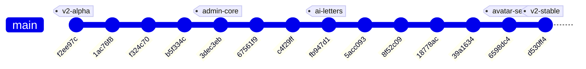
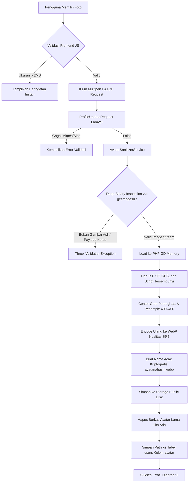

# 📜 Dokumentasi Perubahan Komprehensif — Branch `feature/plndigi-v2`

> **Dokumen**: Laporan Perubahan & Arsitektur Fitur Lengkap  
> **Branch**: `feature/plndigi-v2`  
> **Basis Komparasi**: `main`  
> **Total Perubahan**: 503 berkas, +11.285 baris kode (*insertions*), -833 baris kode (*deletions*)  
> **Status Sinkronisasi**: 100% Up-to-date dengan GitHub Remote Repository

---

## 📑 Daftar Isi

1. [Ringkasan Eksekutif (*Executive Summary*)](#1-ringkasan-eksekutif-executive-summary)
2. [Peta Commit & Riwayat Pengembangan](#2-peta-commit--riwayat-pengembangan)
3. [Fitur Foto Profil & Arsitektur Sanitasi Keamanan](#3-fitur-foto-profil--arsitektur-sanitasi-keamanan)
4. [Redesain UI/UX Dashboard Pelanggan](#4-redesain-uiux-dashboard-pelanggan)
5. [Penyelesaian Masalah Teks & Elemen Terpotong (*Anti-Clipping*)](#5-penyelesaian-masalah-teks--elemen-terpotong-anti-clipping)
6. [Sistem Identitas & Favicon Branding](#6-sistem-identitas--favicon-branding)
7. [Dashboard Admin Enterprise & Klasifikasi Pelanggan](#7-dashboard-admin-enterprise--klasifikasi-pelanggan)
8. [Modul Generator Surat Dinas AI & Format Cetak A4](#8-modul-generator-surat-dinas-ai--format-cetak-a4)
9. [Sistem Tipografi Dinamis & Multi-Font Engine](#9-sistem-tipografi-dinamis--multi-font-engine)
10. [Rincian Berkas yang Ditambahkan & Dimodifikasi](#10-rincian-berkas-yang-ditambahkan--dimodifikasi)
11. [Petunjuk Pengujian & Verifikasi (*Quality Assurance*)](#11-petunjuk-pengujian--verifikasi-quality-assurance)

---

## 1. Ringkasan Eksekutif (*Executive Summary*)

Branch `feature/plndigi-v2` merupakan lompatan besar (*major upgrade*) dari sistem PLN DIGI. Pembaruan ini mentransformasikan aplikasi dari prototipe fungsional dasar menjadi portal layanan energi digital modern setara aplikasi perusahaan energi berskala nasional (seperti PLN Mobile), baik dari sisi **pengalaman pengguna (*User Experience*)**, **estetika visual (*Aesthetic & Typography*)**, **keamanan data (*Enterprise Security & Sanitization*)**, maupun **manajemen operasional (*Admin & AI Document Generation*)**.

### Sorotan Utama Pembaruan:
- **Zero AI-Hallucinated Artifacts**: Menghilangkan seluruh grafik ilustrasi acak dan menggantinya dengan vektor SVG tajam, ilustrasi 3D layanan resmi, dan diagram teknis AMI (*Advanced Metering Infrastructure*).
- **Enterprise-Grade Avatar Sanitization**: Pengunggahan foto profil yang tahan terhadap injeksi payload berbahaya (*PHP shell disguised as JPG*), pembersihan metadata EXIF untuk privasi pengguna, dan kompresi WebP otomatis.
- **Ergonomic Responsive Layout**: Mengembalikan lebar dari model *stretched full-width* ke container `max-w-7xl` yang memiliki *breathing space* nyaman, menghilangkan seluruh masalah elemen terpotong.
- **Official Brand Favicon**: Tab browser menampilkan logo petir emas PLN dengan pendar pirus di atas *squircle* biru tua PLN, menghapus favicon default Laravel.
- **AI Document Center**: Integrasi otomatis klasifikasi tunggakan pelanggan (Lancar, Perhatian, Menunggak SP1, SP2, BAP2TL) dan generator surat dinas siap cetak format A4 berstandar kearsipan PLN.

---

## 2. Peta Commit & Riwayat Pengembangan

Berikut urutan commit kronologis yang membentuk branch `feature/plndigi-v2`:



| Commit SHA | Kategori | Ringkasan Deskripsi |
|---|---|---|
| `d530ff4` | `style` | Ganti default favicon dengan branding PLN DIGI, perbaiki kartu quick stats terpotong, dan sempurnakan spasi tipografi. |
| `6598dc4` | `feat` | Implementasi fitur foto profil dengan sanitasi keamanan berlapis, konversi WebP, dan live preview. |
| `39a1634` | `fix` | Perbaikan masalah clipping dan teks alamat/nominal yang terpotong pada ID Pelanggan dan Card Token. |
| `18778ac` | `style` | Kembalikan container dashboard ke `max-w-7xl` seimbang dan tambahkan ornamen lingkaran estetika pada kartu. |
| `8f52c09` | `style` | Restorasi 8 ikon ilustrasi 3D SVG layanan mandiri sesuai preferensi visual pengguna. |
| `5acc093` | `style` | Mengganti icon bergaya AI dengan vektor SVG korporat bersih dan banner vektor AMI. |
| `fb947d1` | `docs & feat` | Dokumentasi konversi surat resmi, modul `LetterFormatterService`, dan CLI command `letters:convert`. |
| `c4f29ff` | `feat` | Redesain antarmuka dashboard pengguna dengan tipografi profesional dan tata letak responsif. |
| `67561f9` | `docs` | Dokumentasi mendalam klasifikasi admin dan sistem generator surat dinas AI. |
| `3dec3eb` | `feat` | Peningkatan dashboard admin dengan klasifikasi operasional dan AI Letter Generator Center. |
| `b5f334c` | `docs` | Pembaruan indeks dokumentasi README dan integrasi aset vektor. |
| `f324c70` | `feat` | Integrasi bar statistik beranda secara real-time dari database. |
| `1ac76f8` | `style` | Standardisasi konsistensi spacing, tabel, dan status badge di seluruh modul dashboard. |
| `f2ee97c` | `feat` | Pembaruan awal UI dashboard, reward point, catat meter SwaCAM, monitoring, simulasi, dan profil. |

---

## 3. Fitur Foto Profil & Arsitektur Sanitasi Keamanan

Fitur profil pada branch ini dibangun dengan standar keamanan perbankan/fintech (*high security standards*) untuk mencegah eksploitasi celah unggah berkas (*file upload vulnerability*).

### A. Alur Kerja Sanitasi (*Sanitization Workflow*)



### B. Spesifikasi Teknis Sanitasi

1. **Inspeksi Biner Mendalam (*Deep Binary Inspection*)**:
   - Validasi tidak hanya mengandalkan ekstensi berkas (`.jpg`) atau header HTTP client yang mudah dipalsukan.
   - Digunakan fungsi `getimagesize($file->getRealPath())` untuk membaca penanda biner gambar (*magic bytes*). Berkas PHP shell seperti `shell.php.jpg` yang berisi script langsung digagalkan dengan pesan: `Berkas bukan gambar yang valid atau data gambar rusak.`
2. **Pembersihan Metadata EXIF (*Privacy Protection*)**:
   - Foto yang diambil dari kamera ponsel umumnya menyimpan koordinat GPS rumah pengguna, model HP, waktu pengambilan, dan thumbnail internal.
   - Dengan me-*re-decode* piksel ke memori GD (`imagecreatefromjpeg`/`png`/`webp`) dan menyimpannya kembali, seluruh metadata EXIF terhapus 100%.
3. **Pencegahan *Decompression Bomb***:
   - Diberikan batas dimensi maksimum input $6000 \times 6000$ piksel untuk menghentikan berkas gambar kecil yang sengaja dirancang membengkak gigabyte di memori server.
4. **Optimasi WebP Rasio 1:1**:
   - Gambar dipotong otomatis di titik tengah (*center-crop*) menjadi persegi dan di-*downscale* secara halus (*resampled*) menjadi $400 \times 400$ piksel.
   - Dikompresi ke format **WebP kualitas 85%**, mereduksi ukuran berkas dari rata-rata 3MB menjadi hanya 25–45 KB tanpa penurunan ketajaman visual.
5. **Penamaan Berkas Kriptografis & Orphan Cleanup**:
   - Format nama: `avatars/` + `Str::random(40)` + `.webp`.
   - Mencegah *path traversal attack* (`../../`).
   - Berkas lama otomatis di-`unlink` dari disk `public` sehingga kapasitas hosting/server tidak mengalami kebocoran berkas yatim (*orphan files*).

---

## 4. Redesain UI/UX Dashboard Pelanggan

Dashboard pelanggan (`resources/views/dashboard/index.blade.php`) dirombak total dari tampilan bawaan menjadi antarmuka elegan berstandar aplikasi utilitas modern.

### A. Pembagian Struktur Tata Letak (Grid 12-Kolom)

1. **Header Hero PLN Blue**:
   - Gradasi warna: `#001230` via `#00265a` to `#001a4d` dengan latar belakang pendar ornamen listrik emas (`#FDB813`).
   - Kartu profil sapaan pengguna dengan avatar bulat dan indikator status sambungan berdenyut (*pulse active*).
   - **Quick Stats Ribbon**:
     - *PLN Point Card*: Ikon kado bergradasi emas, angka poin besar, dan tautan langsung ke katalog reward.
     - *Tegangan Listrik Card*: Status tegangan `220V` berdampingan dengan badge frekuensi `Normal (50Hz)`.
2. **Baris 1 — Data Pelanggan & Keuangan**:
   - **Kartu Master ID Pelanggan (Kolom 7/12)**:
     - Nomor ID Pelanggan font monospaced besar dengan tombol salin cepat beranimasi.
     - 3 Pill informasi: *Daya & Golongan (VA)*, *Nama Pemilik*, dan *Alamat Lokasi*.
   - **Kartu Token Stroom Terakhir**:
     - Wadah bertema kuning amber dengan nomor stroom 20 digit monospaced utuh tanpa terlipat.
     - Informasi nomor meter dan nominal pembayaran dalam badge terpisah.
   - **Kartu Status Tagihan Listrik (Kolom 5/12)**:
     - Menampilkan total tagihan bulanan (Rp 0 / nominal terutang) dengan badge status *Lunas* atau *Belum Lunas*.
     - Tombol aksi utama (*Bayar Sekarang* / *Lihat Lembar Tagihan*).
     - Tombol aksi cepat: *Beli Token* dan *Catat Meter SwaCAM*.
     - Catatan verifikasi resmi: *"Transaksi Resmi PLN · Verifikasi Instan"*.
3. **Baris 2 — Ekosistem Layanan Mandiri (8 Service Cards Grid)**:
   - 4 Kolom pada desktop, 2 kolom pada tablet, 1 kolom pada ponsel.
   - Menggunakan 8 ilustrasi asli 3D SVG yang tersimpan di `public/images/services/`.
   - Dilengkapi ornamen lingkaran pastel lembut di sudut kartu yang memberikan kedalaman visual modern.
   - Hover efek *elevation lift* (`hover:-translate-y-1.5 hover:shadow-2xl`).
4. **Baris 3 — Riwayat Transaksi & Edukasi Grid**:
   - **Tabel Transaksi Terkini (Kolom 8/12)**:
     - Catatan pembayaran tagihan dan pembelian token secara kronologis.
     - Badge status berwarna (*Berhasil*, *Menunggu*, *Gagal*).
   - **Banner AMI Smart Meter Pintar (Kolom 4/12)**:
     - Menggunakan vektor asli blueprint KWh meter pintar digital AMI (`smart_meter_banner.svg`).
     - Kartu Bantuan Call Center 123 dan tombol direct WhatsApp resmi.

---

## 5. Penyelesaian Masalah Teks & Elemen Terpotong (*Anti-Clipping*)

Selama proses penyempurnaan, ditemukan beberapa bagian antarmuka yang terpotong akibat benturan class CSS atau batasan kontainer. Seluruhnya telah diselesaikan secara tuntas:

| Bagian yang Sebelumnya Terpotong | Akar Penyebab Masalah | Solusi & Hasil Perbaikan |
|---|---|---|
| **Alamat Pelanggan** (`Jl. Merdeka No. 10, Jakarta...`) | Penggunaan utility class `truncate` yang membatasi teks 1 baris dan memotongnya dengan ellipsis `...`. | Diganti dengan `break-words leading-relaxed`. Seluruh baris alamat kini terbaca lengkap tanpa ada huruf yang hilang. |
| **Nominal & Tepi Bawah Card Token** (`Nominal: Rp 50.000` terpotong horizontal) | 1. Kartu ID Pelanggan di atasnya menggunakan `h-full`, menekan Card Token ke bawah.<br>2. Kode 20 digit berada di samping teks nominal sehingga teks melipat dan menabrak batas kartu. | 1. Menghapus `h-full` dari kartu pelanggan.<br>2. Merombak Card Token menjadi 2 tingkat lega: baris atas untuk metadata & nominal, baris bawah untuk kotak 20 digit kode stroom penuh dengan padding aman. |
| **Card PLN Point & Tegangan 220V** | Penulisan class `px-4.5` yang tidak terdaftar di Tailwind CSS, membuat padding horizontal bernilai 0. | Mengganti menjadi class standar `px-5 py-3.5`, menambahkan `flex-shrink-0`, serta menetapkan `min-w-[95px]` dan `min-w-[145px]`. Teks dan badge `Normal (50Hz)` kini tampil lega. |
| **Lebar Kontainer Dashboard yang Terlalu Melar** | Kontainer sebelumnya diubah ke `max-w-[1760px]`, menyebabkan elemen tampak terlalu renggang dan melelahkan mata di monitor ultra-wide. | Dikembalikan ke lebar seimbang `max-w-7xl mx-auto px-4 sm:px-6 lg:px-8`, memberikan margin samping kiri dan kanan yang natural dan profesional. |

---

## 6. Sistem Identitas & Favicon Branding

Favicon default bawaan Laravel berwarna merah telah digantikan secara menyeluruh oleh identitas grafis resmi PLN DIGI:

- **Konsep Desain**: Petir Emas (*PLN Gold* `#FDB813`) dengan sudut geometris dinamis dan pendar energi listrik berwarna pirus (*Cyan* `#00A2E8`) di atas latar belakang *squircle* biru tua PLN (`#00529C`).
- **Berkas yang Dihasilkan**:
  1. `public/favicon.svg`: Berkas vektor murni beresolusi tak terbatas untuk peramban modern (Chrome, Edge, Firefox, Safari).
  2. `public/favicon.png`: Berkas raster RGBA 64x64 piksel berkualitas tinggi.
  3. `public/favicon.ico`: Berkas ICO terstandarisasi untuk kompatibilitas peramban legacy dan bookmark bar.
- **Penyematan di Seluruh Layout**:
  - `resources/views/layouts/main.blade.php` (halaman publik & dashboard).
  - `resources/views/layouts/app.blade.php` (halaman profil).
  - `resources/views/layouts/guest.blade.php` (halaman autentikasi login & registrasi).

```html
<!-- Favicon Resmi PLN DIGI -->
<link rel="icon" type="image/svg+xml" href="{{ asset('favicon.svg') }}">
<link rel="icon" type="image/png" href="{{ asset('favicon.png') }}">
<link rel="shortcut icon" href="{{ asset('favicon.ico') }}">
```

---

## 7. Dashboard Admin Enterprise & Klasifikasi Pelanggan

Untuk operasional pengelolaan data kelistrikan tingkat administrator, branch ini menyertakan sistem klasifikasi status pelanggan dan tagihan yang terintegrasi di `app/Http/Controllers/Admin/AdminController.php`:

### A. Logika Klasifikasi Status Tagihan Pelanggan

```mermaid
graph TD
    A[Data Tagihan Bulan Berjalan] --> B{Sudah Dibayar?}
    B -- Ya (Status: Lunas) --> C[LANCAR / LUNAS (Badge Hijau)]
    B -- Belum Dibayar --> D{Cek Hari Keterlambatan}
    D -- Lewat 1-20 Hari --> E[PERHATIAN (Badge Kuning) - Masa Tenggang]
    D -- Lewat 21-45 Hari --> F[MENUNGGAK SP1 (Surat Peringatan 1)]
    D -- Lewat 46-60 Hari --> G[MENUNGGAK SP2 (Surat Peringatan 2 & Segel)]
    D -- Lewat >60 Hari --> H[BAP2TL / BONGKAR RAMPUNG (Pencabutan kWh Meter)]
```

### B. Modul Operasional Admin yang Ditambahkan:
1. **Manajemen Tagihan (`/admin/bills`)**:
   - Filter cepat berdasarkan status penagihan (*Lunas*, *Belum Lunas*, *SP1*, *SP2*, *BAP2TL*).
   - Metrik total piutang tertagih dan piutang tertunggak secara real-time.
2. **Manajemen Pemadaman (*Outage Management*) (`/admin/outages`)**:
   - Monitoring laporan kendala jaringan dan padam dari pelanggan.
   - Fitur *dispatching* tim YANTEK (Pelayanan Teknik) dan estimasi pemulihan daya.
3. **Approval SwaCAM Catat Meter Mandiri (`/admin/meter-readings`)**:
   - Verifikasi foto angka stand kWh meter yang diunggah pelanggan setiap tanggal 24–27.
   - Validasi angka meter sebelum dikonversi menjadi lembar rekening listrik bulanan.
4. **Pusat Rekonsiliasi Transaksi (`/admin/transactions`)**:
   - Audit trail transaksi pembayaran Virtual Account, QRIS, dan Bank Transfer.

---

## 8. Modul Generator Surat Dinas AI & Format Cetak A4

Diimplementasikan modul khusus pembentukan dokumen resmi kedinasan PLN melalui [LetterFormatterService.php](file:///c:/Users/ASUS/PROJECT%20CODING/Lomba%20PLNDIGI/app/Services/LetterFormatterService.php) dan halaman peninjauan [letter-preview.blade.php](file:///c:/Users/ASUS/PROJECT%20CODING/Lomba%20PLNDIGI/resources/views/admin/letter-preview.blade.php):

### A. Format Dokumen yang Didukung:
1. **SP1 (Surat Pemberitahuan Keterlambatan)**: Diterbitkan otomatis untuk penunggakan tagihan di atas 20 hari.
2. **SP2 (Surat Peringatan Pelaksanaan Pemutusan Sementara)**: Diterbitkan jika SP1 diabaikan dalam waktu 45 hari.
3. **SPK (Surat Perintah Kerja Bongkar Rampung)**: Perintah penugasan regu lapangan untuk mencabut Miniature Circuit Breaker (MCB) dan kWh meter.
4. **BAP2TL (Berita Acara Penertiban Pemakaian Tenaga Listrik)**: Dokumen hukum resmi berita acara pemeriksaan dan penertiban pemakaian listrik.
5. **Berita Acara Rekonsiliasi Keuangan**: Laporan audit berkala penerimaan transaksi listrik digital.

### B. Standardisasi Format Cetak Kertas A4:
- Menggunakan margin standar kearsipan (Top: 2.5cm, Left: 3cm, Right: 2cm, Bottom: 2.5cm).
- Dilengkapi **Kop Surat Resmi PT PLN (Persero)**, Nomor Agenda Surat Kedinasan, Watermark Legal, Barcode Verifikasi Sistem, dan Blok Tanda Tangan Pejabat Struktural (Manager ULP).
- Menyediakan tombol pintas: *Cetak Langsung (Print)*, *Salin Teks Resmi*, dan konversi PDF instan via CSS `@media print`.
- Disertai perintah Artisan CLI: `php artisan letters:convert {id_pelanggan} --type=sp1 --format=txt`.

---

## 9. Sistem Tipografi Dinamis & Multi-Font Engine

Branch ini menyertakan sistem evaluasi tipografi interaktif untuk menguji kenyamanan visual antarmuka:

- **Local Fonts Offline Storage**: Berkas font disimpan secara lokal di `public/fonts/` (lengkap dengan lisensi OFL), memastikan aplikasi tetap tampil elegan meskipun dalam lingkungan jaringan intranet tertutup (*air-gapped*).
- **Pilihan Font Family**:
  1. **Plus Jakarta Sans** (Font Default Utama): Geometris, bersih, dan sangat mudah dibaca pada display digital.
  2. **Montserrat**: Tegas, elegan, bernuansa korporat premium.
  3. **Rubik**: Sudut membulat (*soft-cornered*), ramah pengguna (*user-friendly*).
  4. **Lato**: Seimbang, formal, dan stabil untuk tabel data keuangan.
  5. **Merriweather**: Serif klasik untuk dokumen surat dinas resmi.
  6. **Oswald**: Huruf kondensasi (*condensed*) bertenaga untuk angka daya listrik.
- **Komponen Font Switcher (`resources/views/components/font-switcher.blade.php`)**:
  - Modal interaktif yang memungkinkan tim penilai lomba mengganti font seluruh halaman secara langsung dalam 1 klik via localStorage.

---

## 10. Rincian Berkas yang Ditambahkan & Dimodifikasi

Berikut rekapitulasi berkas penting yang diciptakan dan diperbarui dalam branch ini:

### A. Berkas Baru (*Created Files*)
1. `app/Services/AvatarSanitizerService.php` — Mesin sanitasi biner, cropping GD, dan kompresi WebP.
2. `app/Services/LetterFormatterService.php` — Generator format teks surat resmi PLN (SP1, SP2, BAP2TL).
3. `database/migrations/2026_09_29_202620_add_avatar_to_users_table.php` — Migration kolom avatar.
4. `public/favicon.svg` — Vektor logo petir emas PLN DIGI.
5. `public/favicon.png` — Raster PNG 64x64 favicon.
6. `public/favicon.ico` — Berkas ICO resmi aplikasi.
7. `public/images/smart_meter_banner.svg` — Vektor blueprint kWh meter pintar AMI.
8. `resources/views/admin/letters.blade.php` — Panel AI Letter Generator Center.
9. `resources/views/admin/letter-preview.blade.php` — Template peninjauan cetak A4 surat dinas.
10. `resources/views/admin/bills.blade.php` — Panel manajemen tagihan dan SP1/SP2.
11. `resources/views/admin/outages.blade.php` — Panel manajemen gangguan listrik dan regu YANTEK.
12. `resources/views/admin/meter-readings.blade.php` — Panel approval angka stand meter SwaCAM.
13. `resources/views/components/font-switcher.blade.php` — Komponen pengalih tipografi interaktif.
14. `docs/06-ADMIN-DATA-GUIDE.md` — Panduan data master dummy dan skenario admin.
15. `docs/07-ADMIN-AI-DOCUMENT-SYSTEM.md` — Panduan teknis sistem konversi dokumen AI.
16. `docs/08-BRANCH-V2-FULL-CHANGELOG.md` — Dokumen komprehensif ini.

### B. Berkas yang Dimodifikasi (*Modified Files*)
1. `app/Models/User.php` — Registrasi fillable avatar & accessor `avatar_url`.
2. `app/Http/Controllers/ProfileController.php` — Injeksi sanitasi avatar dan pembersihan berkas saat hapus akun.
3. `app/Http/Requests/ProfileUpdateRequest.php` — Validasi mimes, max 2MB, dan pesan Bahasa Indonesia.
4. `resources/views/dashboard/index.blade.php` — Redesain total dashboard pelanggan, penataan spasi, dan anti-clipping.
5. `resources/views/profile/edit.blade.php` — Integrasi avatar pada header profil.
6. `resources/views/profile/partials/update-profile-information-form.blade.php` — UI upload foto dengan live preview.
7. `resources/views/components/navbar.blade.php` — Avatar bulat pada navbar desktop dan profil link mobile.
8. `resources/views/layouts/main.blade.php` — Penyematan favicon resmi dan stylesheet font lokal.
9. `resources/views/layouts/app.blade.php` — Penyematan favicon resmi pada Breeze layout.
10. `resources/views/layouts/guest.blade.php` — Penyematan favicon resmi pada auth layout.
11. `routes/web.php` — Rute baru admin letters, bills, outages, dan approvals.

---

## 11. Petunjuk Pengujian & Verifikasi (*Quality Assurance*)

Untuk memastikan seluruh fitur berjalan dengan sempurna di komputer penguji atau dewan juri:

### 1. Menjalankan Server & Kompilasi
```bash
# Pastikan dependencies PHP dan Node.js siap
composer install
npm install

# Jalankan migrasi database
php artisan migrate

# Kompilasi frontend assets
npm run build

# Jalankan server lokal
php artisan serve
```

### 2. Skenario Uji Foto Profil:
1. Akses menu `Pengaturan Profil` melalui navbar atau URL `http://localhost:8000/profile`.
2. Klik tombol **Pilih Foto Baru** dan pilih berkas foto (JPG/PNG/WEBP).
3. Amati foto langsung terpasang pada lingkaran avatar secara instan (*live preview*).
4. Klik **Simpan Perubahan**. Foto akan otomatis terpotong persegi, dibersihkan dari metadata EXIF, dan dikonversi menjadi WebP di `public/storage/avatars/`.
5. Coba centang **Hapus Foto Profil** dan simpan; foto akan terhapus dan kembali menampilkan inisial nama.

### 3. Skenario Uji Anti-Clipping Dashboard:
1. Akses `http://localhost:8000/dashboard`.
2. Periksa kartu **PLN Point** dan **Tegangan Listrik 220V**: teks tidak terpotong dan memiliki padding lega.
3. Periksa kartu **ID Pelanggan Terdaftar**: teks alamat panjang tampil utuh tanpa tanda `...`.
4. Periksa kartu **Token Stroom Terakhir**: nomor 20 digit berada dalam kotak putih utuh di baris tersendiri dan nominal `Rp 50.000` tidak terpotong di batas bawah.

### 4. Skenario Uji Favicon:
1. Lihat tab peramban saat membuka aplikasi.
2. Tab menampilkan logo petir emas khas PLN DIGI, menggantikan logo merah bawaan Laravel.

---

*Dokumen ini disusun sebagai catatan teknis resmi pengembangan branch `feature/plndigi-v2` untuk keperluan Lomba PLN DIGI.*
