# DIAGRAM ALUR KERJA & WORKFLOW SISTEM TERPADU PLN DIGI

Dokumen ini memuat diagram alur menyeluruh (*end-to-end system workflow*) dari platform **PLN DIGI (OMNIDIGI)**, memetakan interaksi dari sisi Pengunjung Publik, Pelanggan Terdaftar, Mesin Pembayaran, Otomasi Backoffice Admin, Generator Dokumen AI, hingga Struktur Basis Data 3NF.

---

## 1. Flowchart Arsitektur & Alur Kerja Menyeluruh

Diagram berikut dapat disalin (*copy-paste*) langsung ke editor Mermaid (seperti [mermaid.live](https://mermaid.live)) atau dimasukkan ke dalam slide presentasi / dokumen teknis:

```mermaid
flowchart TD

    %% -------------------------------------------------------------
    %% AKTOR SISTEM
    %% -------------------------------------------------------------
    UserGuest["Pengunjung Publik / Tamu"]
    UserAuth["Pelanggan Terdaftar (User Login)"]
    AdminActor["Staf Operasional / Admin PLN"]

    %% -------------------------------------------------------------
    %% 1. LAPISAN PUBLIK
    %% -------------------------------------------------------------
    subgraph SubPublic["1. Portal Layanan Publik (Frontend)"]
        Landing["Landing Page (/)"]
        QuickSearch["Quick Lookup ID Pelanggan"]
        SimulasiPage["Kalkulator Simulasi Tarif (/simulasi)"]
        NewsPortal["Portal Berita & Edukasi (/news)"]
        ProdukMenu["Menu Produk Kelistrikan (/produk)"]
        TagihanPublic["Cek Tagihan Pascabayar (/produk/tagihan)"]
        TokenPublic["Pembelian Token Prabayar (/produk/token)"]
        AuthLogin["Login & Registrasi Breeze (/login)"]
    end

    UserGuest --> Landing
    Landing --> QuickSearch
    Landing --> SimulasiPage
    Landing --> NewsPortal
    Landing --> ProdukMenu
    ProdukMenu --> TagihanPublic
    ProdukMenu --> TokenPublic
    Landing --> AuthLogin

    %% -------------------------------------------------------------
    %% 2. TRANSAKSI & PAYMENT GATEWAY
    %% -------------------------------------------------------------
    subgraph SubPayment["2. Mesin Transaksi & Gateway Pembayaran"]
        Checkout["Checkout & Verifikasi Tagihan"]
        ChannelPay["Pilihan Multi-Channel Pembayaran"]
        QRIS["QRIS Dinamis (Simulator Scan)"]
        VA["Virtual Account (BCA, Mandiri, BNI, BRI)"]
        EWallet["E-Wallet (GoPay, OVO, DANA)"]
        TrxProcess["Pemrosesan Status Transaksi"]
        Receipt["Penerbitan Struk Digital & Token 20 Digit"]
    end

    TagihanPublic --> Checkout
    TokenPublic --> Checkout
    Checkout --> ChannelPay
    ChannelPay --> QRIS
    ChannelPay --> VA
    ChannelPay --> EWallet
    QRIS --> TrxProcess
    VA --> TrxProcess
    EWallet --> TrxProcess
    TrxProcess --> Receipt

    %% -------------------------------------------------------------
    %% 3. DASHBOARD PELANGGAN TERDAFTAR
    %% -------------------------------------------------------------
    subgraph SubUserDash["3. Dashboard Pelanggan Terdaftar (Self-Service)"]
        DashHome["Dashboard Utama (/dashboard)"]
        ActiveBillCard["Monitoring Tagihan & Countdown Jatuh Tempo"]
        SmartCarousel["Smart Auto-Slide Promo Carousel"]
        QuickToken["Quick Token Stroom & Riwayat Transaksi"]
        SwaCAM["SwaCAM Catat Meter Mandiri (/dashboard/metering)"]
        MonitoringChart["Monitoring Grafik Konsumsi kWh (/dashboard/monitoring)"]
        OutageReport["Pengaduan Gangguan Listrik (/dashboard/outage)"]
        ApplianceCalc["Simulasi Beban Elektronik (/dashboard/simulasi)"]
        DigiReward["PLN DigiPoints & Tukar Voucher (/dashboard/reward)"]
    end

    AuthLogin --> UserAuth
    UserAuth --> DashHome
    DashHome --> ActiveBillCard
    DashHome --> SmartCarousel
    DashHome --> QuickToken
    DashHome --> SwaCAM
    DashHome --> MonitoringChart
    DashHome --> OutageReport
    DashHome --> ApplianceCalc
    DashHome --> DigiReward
    ActiveBillCard --> Checkout

    %% -------------------------------------------------------------
    %% 4. BACKOFFICE COMMAND CENTER & CRM ADMIN
    %% -------------------------------------------------------------
    subgraph SubAdminDash["4. Backoffice Command Center (Admin Only)"]
        AdminAuth["Middleware RBAC Guard (role: admin)"]
        AdminHome["Command Center Utama (/admin)"]
        CustomerCRM["Manajemen Data Master Pelanggan (/admin/customers)"]
        TrxAudit["Monitoring & Audit Seluruh Transaksi (/admin/transactions)"]
        BillsAdmin["Manajemen Piutang & Billing (/admin/bills)"]
        OutagesAdmin["Pusat Laporan Gangguan YANTEK (/admin/outages)"]
        MeterAudit["Verifikasi Hasil Baca SwaCAM (/admin/meter-readings)"]
        LetterCenter["Pusat Dokumen Kedinasan (/admin/letters)"]
    end

    AdminActor --> AdminAuth
    AdminAuth --> AdminHome
    AdminHome --> CustomerCRM
    AdminHome --> TrxAudit
    AdminHome --> BillsAdmin
    AdminHome --> OutagesAdmin
    AdminHome --> MeterAudit
    AdminHome --> LetterCenter

    %% -------------------------------------------------------------
    %% 5. LOGIKA OPERASIONAL CERDAS (INTELLIGENT OPERATIONS)
    %% -------------------------------------------------------------
    subgraph SubLogic["5. Otomasi & Logika Operasional Cerdas"]
        AgingMatrix["Aging Overdue Matrix (Lancar ke SP-1 ke SP-2 ke SPK)"]
        YantekTriase["Triase Keparahan Insiden (Kritis SLA 30m vs Normal)"]
        AnomalyDetection["Audit SwaCAM Anomaly Detection (Filter Lonjakan >400 kWh)"]
    end

    BillsAdmin --> AgingMatrix
    OutagesAdmin --> YantekTriase
    MeterAudit --> AnomalyDetection

    %% -------------------------------------------------------------
    %% 6. GENERATOR DOKUMEN KEDINASAN & AI BRIDGE
    %% -------------------------------------------------------------
    subgraph SubDocumentAI["6. Generator Naskah Dinas & Jembatan AI"]
        LetterTemplates["4 Template Standar BUMN (SP1, SP2, SPK YANTEK, BA P2TL)"]
        NumberingEngine["Algoritma Penomoran Resmi Format PLN"]
        PrintEngine["Native CSS Print Engine (Layout A4 Resmi)"]
        AIJSONBridge["JSON Schema Payload (Siap Konsumsi LLM / AI Agent)"]
        WABroadcast["Formatter Teks WhatsApp Broadcast Gateway"]
    end

    LetterCenter --> LetterTemplates
    AgingMatrix -. Pemicu Penagihan .-> LetterCenter
    YantekTriase -. Pemicu Tugas Lapangan .-> LetterCenter
    LetterTemplates --> NumberingEngine
    NumberingEngine --> PrintEngine
    LetterTemplates --> AIJSONBridge
    LetterTemplates --> WABroadcast

    %% -------------------------------------------------------------
    %% 7. BASIS DATA TERNORMALISASI 3NF
    %% -------------------------------------------------------------
    subgraph SubDatabase["7. Basis Data Relasional MySQL (3NF Normalized)"]
        TableUsers["Tabel users (Role: admin / user)"]
        TableCustomers["Tabel customers (Tarif, Daya, Alamat)"]
        TableTariffs["Tabel tariffs & tariff_categories"]
        TableBills["Tabel bills (Status: unpaid, paid, overdue)"]
        TableTransactions["Tabel transactions (Struk, QRIS, Token)"]
        TableReadings["Tabel meter_readings (SwaCAM Foto & Stand)"]
        TableOutages["Tabel outage_reports (Status & Severity)"]
        TableRewards["Tabel reward_claims (Poin & Voucher)"]
    end

    %% Hubungan Sisi User ke Database
    TrxProcess --> TableTransactions
    Receipt --> TableBills
    SwaCAM --> TableReadings
    OutageReport --> TableOutages
    DigiReward --> TableRewards

    %% Hubungan Sisi Admin ke Database
    CustomerCRM <--> TableCustomers
    CustomerCRM <--> TableTariffs
    TrxAudit <--> TableTransactions
    BillsAdmin <--> TableBills
    OutagesAdmin <--> TableOutages
    MeterAudit <--> TableReadings
    AdminAuth <--> TableUsers

    %% -------------------------------------------------------------
    %% STYLING CORAK WARNA PLN (NAVY & GOLD)
    %% -------------------------------------------------------------
    classDef default font-family:'Plus Jakarta Sans',sans-serif;
    classDef actorStyle fill:#001A4D,stroke:#FDB813,stroke-width:2px,color:#FFFFFF;
    classDef publicStyle fill:#F0F7FF,stroke:#00529C,stroke-width:1.5px,color:#001A4D;
    classDef paymentStyle fill:#FEF3C7,stroke:#D97706,stroke-width:1.5px,color:#78350F;
    classDef userStyle fill:#ECFDF5,stroke:#059669,stroke-width:1.5px,color:#064E3B;
    classDef adminStyle fill:#EFF6FF,stroke:#2563EB,stroke-width:1.5px,color:#1E3A8A;
    classDef logicStyle fill:#FDF2F8,stroke:#DB2777,stroke-width:1.5px,color:#831843;
    classDef aiStyle fill:#FAF5FF,stroke:#7C3AED,stroke-width:1.5px,color:#4C1D95;
    classDef dbStyle fill:#F8FAFC,stroke:#475569,stroke-width:1.5px,color:#0F172A;

    class UserGuest,UserAuth,AdminActor actorStyle;
    class Landing,QuickSearch,SimulasiPage,NewsPortal,ProdukMenu,TagihanPublic,TokenPublic,AuthLogin publicStyle;
    class Checkout,ChannelPay,QRIS,VA,EWallet,TrxProcess,Receipt paymentStyle;
    class DashHome,ActiveBillCard,SmartCarousel,QuickToken,SwaCAM,MonitoringChart,OutageReport,ApplianceCalc,DigiReward userStyle;
    class AdminAuth,AdminHome,CustomerCRM,TrxAudit,BillsAdmin,OutagesAdmin,MeterAudit,LetterCenter adminStyle;
    class AgingMatrix,YantekTriase,AnomalyDetection logicStyle;
    class LetterTemplates,NumberingEngine,PrintEngine,AIJSONBridge,WABroadcast aiStyle;
    class TableUsers,TableCustomers,TableTariffs,TableBills,TableTransactions,TableReadings,TableOutages,TableRewards dbStyle;
```

---

## 2. Penjelasan Alur Kerja 7 Zona Utama

### Zona 1: Portal Layanan Publik (Frontend)
* Pengunjung masuk ke Landing Page utama (`/`).
* Melalui widget Hero Section, pengunjung dapat memasukkan 12 digit ID Pelanggan untuk melakukan pengecekan rekening tanpa perlu login (*Zero Friction*).
* Pengunjung dapat mengakses portal Berita (`/news`), Kalkulator Simulasi Biaya Pasang Baru (`/simulasi`), atau menuju katalog Produk (`/produk`).

### Zona 2: Mesin Transaksi & Gateway Pembayaran
* Pelanggan memilih transaksi: bayar tagihan listrik bulanan atau beli token stroom prabayar.
* Sistem mengonfirmasi nominal, potongan PPJ, dan biaya admin.
* Pelanggan memilih metode pembayaran: QRIS dinamis (dengan simulator scan instan), Virtual Account Bank, atau E-Wallet.
* Setelah diverifikasi sukses, sistem menerbitkan lembar struk digital resmi berstandar perbankan dan mengenerate 20 digit kode token stroom unik.

### Zona 3: Dashboard Pelanggan Terdaftar (Self-Service)
* Pelanggan yang telah login masuk ke pusat kendali pribadi (`/dashboard`).
* Memantau status tagihan bulan berjalan dengan peringatan jatuh tempo tanggal 20.
* Berinteraksi dengan Smart Promo Carousel otomatis (4 kartu informasi AMI, Tambah Daya, DigiPoints, dan SwaCAM).
* Mengakses empat layanan mandiri:
  1. **SwaCAM:** Mengirim foto angka meteran fisik tanggal 24–27 setiap bulannya.
  2. **Monitoring:** Memantau visualisasi grafik konsumsi kWh dan tren biaya bulanan.
  3. **Pengaduan Gangguan (Outages):** Melaporkan listrik padam atau kerusakan meteran dengan bukti foto lokasi.
  4. **DigiPoints Reward:** Mengumpulkan poin dari pembayaran tepat waktu dan menukarnya menjadi voucher diskon token.

### Zona 4: Backoffice Command Center & CRM Admin
* Rute `/admin` diproteksi secara ketat menggunakan middleware Role-Based Access Control (`AdminMiddleware`).
* Admin memonitor metrik agregasi harian secara real-time (total pendapatan, saldo piutang, antrean tiket gangguan, dan verifikasi SwaCAM).
* Melakukan pencarian, penambahan, edit, dan audit data master pelanggan lintas golongan tarif (Rumah Tangga R1/R2, Bisnis B1/B2, Industri, dan Sosial).

### Zona 5: Otomasi Operasional Cerdas (Intelligent Operations)
* **Aging Overdue Matrix:** Kueri berbasis tanggal server otomatis memetakan tagihan yang lewat tanggal 20 ke status Overdue, menghitung denda, dan mengarahkan ke pipeline penagihan bertingkat (Lancar ➔ SP-1 ➔ SP-2 ➔ SPK Pemutusan).
* **Triase Gangguan YANTEK:** Laporan pemadaman total atau korsleting otomatis diklasifikasikan ke prioritas 'Kritis' untuk percepatan dispatch teknisi lapangan.
* **Audit SwaCAM Anomaly Detection:** Sistem menyaring anomali angka stand meter (lonjakan di atas 400 kWh atau penurunan drastis tidak wajar) untuk diverifikasi petugas sebelum tagihan diterbitkan.

### Zona 6: Generator Dokumen Kedinasan & Jembatan AI
* Menyediakan 4 template surat resmi BUMN (SP-1, SP-2, SPK YANTEK, Berita Acara P2TL).
* Mengotomasi nomor surat resmi berstandar format tata naskah PT PLN (Persero) dan mencantumkan konsideran dasar hukum Peraturan Menteri ESDM No. 27 Tahun 2017.
* Merender pratinjau A4 presisi siap cetak menggunakan Native CSS Print Engine tanpa membebani server.
* Menyediakan output JSON Schema terstruktur dan service konversi teks WhatsApp untuk integrasi AI Agent (LLM) dan WhatsApp Gateway.

### Zona 7: Basis Data Relasional MySQL (3NF Normalized)
* Seluruh data disimpan dalam 11 tabel ternormalisasi Third Normal Form (3NF).
* Relasi transaksi, tagihan, dan meteran menggunakan aturan kunci asing `ON DELETE RESTRICT` untuk mencegah manipulasi data sepihak dan menjamin audit trail finansial yang andal.
